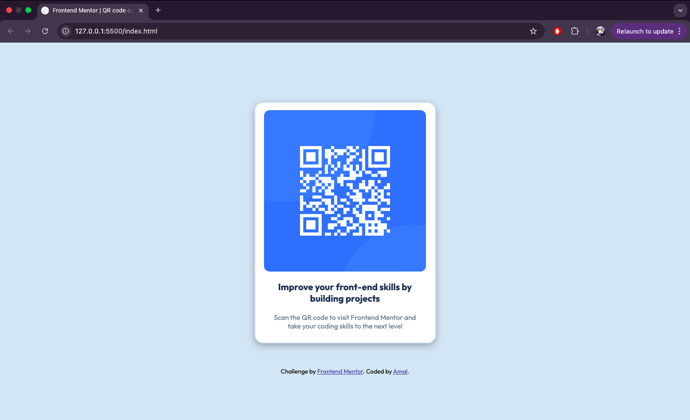

# Frontend Mentor - QR code component solution

This is a solution to the [QR code component challenge on Frontend Mentor](https://www.frontendmentor.io/challenges/qr-code-component-iux_sIO_H). Frontend Mentor challenges help you improve your coding skills by building realistic projects. 

## Table of contents

- [Overview](#overview)
  - [Screenshot](#screenshot)
  - [Links](#links)
- [My process](#my-process)
  - [Built with](#built-with)
  - [What I learned](#what-i-learned)
- [Author](#author)

## Overview

The goal of this challenge was to build a simple and visually appealing QR code card component. It required clean, semantic HTML and well-structured, responsive CSS. The project is beginner-friendly and focuses on mastering layout techniques like Flexbox and improving design consistency with reusable styles. The final design mimics a real-world component that could be used in a landing page or a digital product.

### Screenshot



### Links

- Solution URL: [QR Code Components on GitHub](https://github.com/arashid01/qr_code_component)
- Live Site URL: [Live preview on GitHub pages](https://arashid01.github.io/qr_code_component/)

## My process

### Built with

- Semantic HTML5 markup
- CSS custom properties
- Flexbox

### What I learned

This challenge helped me reinforce the basics of HTML and CSS. I practiced:

- Structuring HTML semantically.
- Using Flexbox to center content vertically and horizontally.
- Applying responsive design principles using media queries.
- Utilizing Google Fonts for improved typography.
- Creating a visually appealing card component with shadows, borders, and rounded corners.

Here's a snippet I'm proud of that handles responsiveness nicely:

```css
@media (min-width: 376px) {
	.container {
		width: 375px;
	}

	#firstLine {
		font-size: 1.2rem;
	}

	#secondLine {
		font-size: 0.9rem;
	}
}

## Author

- Website - [Amal](linkedin.com/in/amal-rashid-ba91001b2/)
- Frontend Mentor - [@arashid01](https://www.frontendmentor.io/profile/arashid01)